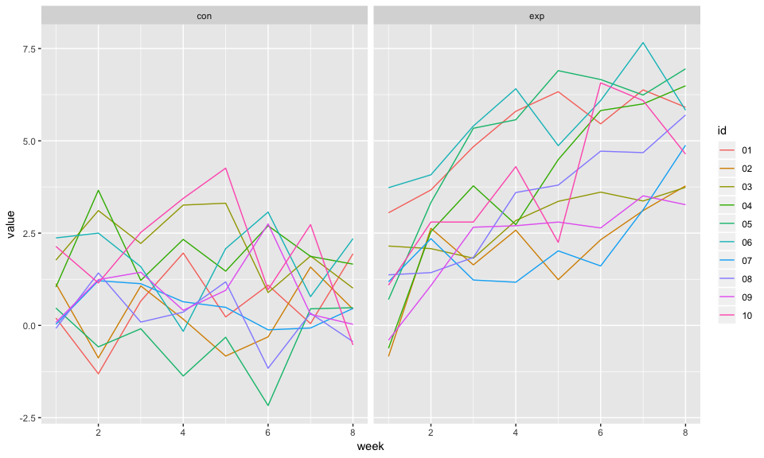

Homework 5
================
Xinyi Lin
11/1/2018

``` r
library(tidyverse)
```

    ## ── Attaching packages ──────────────────────────────────────────────────────────────────────── tidyverse 1.2.1 ──

    ## ✔ ggplot2 3.0.0     ✔ purrr   0.2.5
    ## ✔ tibble  1.4.2     ✔ dplyr   0.7.6
    ## ✔ tidyr   0.8.1     ✔ stringr 1.3.1
    ## ✔ readr   1.1.1     ✔ forcats 0.3.0

    ## ── Conflicts ─────────────────────────────────────────────────────────────────────────── tidyverse_conflicts() ──
    ## ✖ dplyr::filter() masks stats::filter()
    ## ✖ dplyr::lag()    masks stats::lag()

``` r
knitr::opts_chunk$set(
  fig.width = 10,
  fig.asp = .6,
  out.width = "90%"
)
```

Problem One
===========

``` r
hw5_data_df = tibble(list.files("./data")) %>% 
  janitor::clean_names() %>% 
  mutate(files_name_wd = str_c("./data/", list_files_data),
         files_name = str_replace(list_files_data, ".csv", "")) %>% 
  select(-list_files_data)

head(hw5_data_df)
```

    ## # A tibble: 6 x 2
    ##   files_name_wd     files_name
    ##   <chr>             <chr>     
    ## 1 ./data/con_01.csv con_01    
    ## 2 ./data/con_02.csv con_02    
    ## 3 ./data/con_03.csv con_03    
    ## 4 ./data/con_04.csv con_04    
    ## 5 ./data/con_05.csv con_05    
    ## 6 ./data/con_06.csv con_06

``` r
hw5_tidied_data =
  hw5_data_df %>% 
  mutate(data = map(files_name_wd, read_csv)) %>% 
  bind_rows() %>% 
  unnest() %>% 
  gather(key = week, value = value, week_1:week_8) %>% 
  select(-files_name_wd) %>% 
  separate(files_name, into = c("groups", "id"), sep = "_") %>% 
  mutate(week = str_replace(week, "week_", "")) %>% 
  mutate(week = as.numeric(week)) %>% 
  mutate(value = as.numeric(value)) 

head(hw5_tidied_data)
```

    ## # A tibble: 6 x 4
    ##   groups id     week value
    ##   <chr>  <chr> <dbl> <dbl>
    ## 1 con    01        1  0.2 
    ## 2 con    02        1  1.13
    ## 3 con    03        1  1.77
    ## 4 con    04        1  1.04
    ## 5 con    05        1  0.47
    ## 6 con    06        1  2.37

``` r
hw5_tidied_data %>% 
  ggplot(aes(x = week, y = value, color = id)) +
  #geom_point() +
  geom_line() +
  facet_grid(.~ groups)
```



Through this plot, we can find that the values of subjects in two groups are similar at the beginning. However, the values of subjects in experiment group increased over time while the values of subjects in control group keep the same.

Problem Two
===========

Tidied data
-----------

First, I create a `city_state` variable by combining `city` and `state`. As there is only one record about "Tulsa, AL", I think it infact happened in "Tulsa, OK" but recorded as "Tulsa, AL" mistakenly, so I changed it to "Tulsa, OK".

``` r
homicide_df = read_csv("homicide-data.csv") %>% 
  mutate(city_state = str_c(city, ", ", state)) %>% 
  mutate(city_state = str_replace(city_state, "Tulsa, AL", "Tulsa, OK"))
```

    ## Parsed with column specification:
    ## cols(
    ##   uid = col_character(),
    ##   reported_date = col_integer(),
    ##   victim_last = col_character(),
    ##   victim_first = col_character(),
    ##   victim_race = col_character(),
    ##   victim_age = col_character(),
    ##   victim_sex = col_character(),
    ##   city = col_character(),
    ##   state = col_character(),
    ##   lat = col_double(),
    ##   lon = col_double(),
    ##   disposition = col_character()
    ## )

The original dataset gathered information about homicides in 50 large U.S. cities including the location of the killing, whether an arrest was made and, in most cases, basic demographic information about each victim. It cantains 13 variables and 52179 observations. Main variables are `city`, `state` and `disposition`

Number of total and unsolved homicides
--------------------------------------

``` r
city_total_homicides =
  homicide_df %>% 
  group_by(city_state) %>% 
  summarise(total_num = n()) %>% 
  arrange(desc(total_num))

head(city_total_homicides)
```

    ## # A tibble: 6 x 2
    ##   city_state       total_num
    ##   <chr>                <int>
    ## 1 Chicago, IL           5535
    ## 2 Philadelphia, PA      3037
    ## 3 Houston, TX           2942
    ## 4 Baltimore, MD         2827
    ## 5 Detroit, MI           2519
    ## 6 Los Angeles, CA       2257

``` r
city_unsolved_homicides =
  homicide_df %>% 
  filter(disposition == "Closed without arrest" | disposition == "Open/No arrest") %>% 
  group_by(city_state) %>% 
  #summarise(n = n()) %>%
  summarise(unsolved_num = n()) %>%
  arrange(desc(unsolved_num))

head(city_unsolved_homicides)
```

    ## # A tibble: 6 x 2
    ##   city_state       unsolved_num
    ##   <chr>                   <int>
    ## 1 Chicago, IL              4073
    ## 2 Baltimore, MD            1825
    ## 3 Houston, TX              1493
    ## 4 Detroit, MI              1482
    ## 5 Philadelphia, PA         1360
    ## 6 Los Angeles, CA          1106

Proportion of Baltimore and MD
------------------------------

``` r
two_cities_total_homicides = 
  city_total_homicides %>% 
  filter(city_state == "Baltimore, MD")

two_cities_unsolved_homicides =
  city_unsolved_homicides %>% 
  filter(city_state == "Baltimore, MD")

prop_Baltimore = 
  prop.test(two_cities_unsolved_homicides$unsolved_num, two_cities_total_homicides$total_num)

prop_Baltimore %>% 
  broom::tidy() %>% 
  pull(estimate)
```

    ## [1] 0.6455607

``` r
prop_Baltimore %>% 
  broom::tidy() %>% 
  pull(conf.low)
```

    ## [1] 0.6275625

``` r
prop_Baltimore %>% 
  broom::tidy() %>% 
  pull(conf.high)
```

    ## [1] 0.6631599

``` r
city_homicides = left_join(city_total_homicides, city_unsolved_homicides, by = "city_state")
  
city_homicides[is.na(city_homicides)] = 0
```

``` r
city_prop = 
  city_homicides %>% 
  mutate(parameters = map2(city_homicides$unsolved_num, city_homicides$total_num, prop.test)) %>% 
  mutate(parameters = map(parameters, broom::tidy)) %>% 
  unnest() %>% 
  janitor::clean_names() 

head(city_prop)
```

    ## # A tibble: 6 x 11
    ##   city_state total_num unsolved_num estimate statistic   p_value parameter
    ##   <chr>          <int>        <int>    <dbl>     <dbl>     <dbl>     <int>
    ## 1 Chicago, …      5535         4073    0.736  1231.    1.28e-269         1
    ## 2 Philadelp…      3037         1360    0.448    32.9   9.80e-  9         1
    ## 3 Houston, …      2942         1493    0.507     0.628 4.28e-  1         1
    ## 4 Baltimore…      2827         1825    0.646   239.    6.46e- 54         1
    ## 5 Detroit, …      2519         1482    0.588    78.3   9.03e- 19         1
    ## 6 Los Angel…      2257         1106    0.490     0.858 3.54e-  1         1
    ## # ... with 4 more variables: conf_low <dbl>, conf_high <dbl>,
    ## #   method <chr>, alternative <chr>

Draw a plot
-----------

``` r
city_prop %>% 
  mutate(city_state = fct_reorder(city_state, desc(estimate))) %>% 
  ggplot(aes(x = city_state, y = estimate)) +
  geom_point() +
  geom_errorbar(aes(ymin = conf_low, ymax = conf_high)) +
  theme(axis.text.x = element_text(angle = 45, hjust = 1))
```


