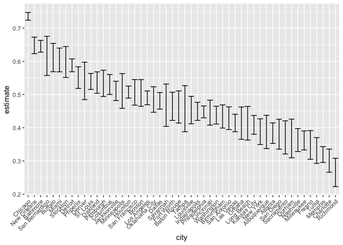

Homework 5
================
Xinyi Lin
11/1/2018

``` r
library(tidyverse)
```

    ## ── Attaching packages ──────────────────────────────────────────────────────────────────────── tidyverse 1.2.1 ──

    ## ✔ ggplot2 3.0.0     ✔ purrr   0.2.5
    ## ✔ tibble  1.4.2     ✔ dplyr   0.7.6
    ## ✔ tidyr   0.8.1     ✔ stringr 1.3.1
    ## ✔ readr   1.1.1     ✔ forcats 0.3.0

    ## ── Conflicts ─────────────────────────────────────────────────────────────────────────── tidyverse_conflicts() ──
    ## ✖ dplyr::filter() masks stats::filter()
    ## ✖ dplyr::lag()    masks stats::lag()

Problem One
===========

``` r
hw5_data_df = tibble(list.files("./data")) %>% 
  janitor::clean_names() %>% 
  mutate(files_name_wd = str_c("./data/", list_files_data),
         files_name = list_files_data) %>% 
  select(-list_files_data)

head(hw5_data_df)
```

    ## # A tibble: 6 x 2
    ##   files_name_wd     files_name
    ##   <chr>             <chr>     
    ## 1 ./data/con_01.csv con_01.csv
    ## 2 ./data/con_02.csv con_02.csv
    ## 3 ./data/con_03.csv con_03.csv
    ## 4 ./data/con_04.csv con_04.csv
    ## 5 ./data/con_05.csv con_05.csv
    ## 6 ./data/con_06.csv con_06.csv

``` r
hw5_tidied_data =
  hw5_data_df %>% 
  mutate(data = map(files_name_wd, read_csv)) %>% 
  bind_rows() %>% 
  unnest() %>% 
  gather(key = week, value = value, week_1:week_8) %>% 
  select(-files_name_wd) %>% 
  mutate(week = str_replace(week, "week_", ""))

head(hw5_tidied_data)
```

    ## # A tibble: 6 x 15
    ##   files_name uid   reported_date victim_last victim_first victim_race
    ##   <chr>      <chr>         <int> <chr>       <chr>        <chr>      
    ## 1 con_01.csv <NA>             NA <NA>        <NA>         <NA>       
    ## 2 con_02.csv <NA>             NA <NA>        <NA>         <NA>       
    ## 3 con_03.csv <NA>             NA <NA>        <NA>         <NA>       
    ## 4 con_04.csv <NA>             NA <NA>        <NA>         <NA>       
    ## 5 con_05.csv <NA>             NA <NA>        <NA>         <NA>       
    ## 6 con_06.csv <NA>             NA <NA>        <NA>         <NA>       
    ## # ... with 9 more variables: victim_age <chr>, victim_sex <chr>,
    ## #   city <chr>, state <chr>, lat <dbl>, lon <dbl>, disposition <chr>,
    ## #   week <chr>, value <dbl>

Problem Two
===========

Tidied data
-----------

``` r
homicide_df = read_csv("./data/homicide-data.csv") %>% 
  mutate(city_state = str_c(city, ", ", state))
```

    ## Parsed with column specification:
    ## cols(
    ##   uid = col_character(),
    ##   reported_date = col_integer(),
    ##   victim_last = col_character(),
    ##   victim_first = col_character(),
    ##   victim_race = col_character(),
    ##   victim_age = col_character(),
    ##   victim_sex = col_character(),
    ##   city = col_character(),
    ##   state = col_character(),
    ##   lat = col_double(),
    ##   lon = col_double(),
    ##   disposition = col_character()
    ## )

The original dataset gathered information about homicides in 50 large U.S. cities including the location of the killing, whether an arrest was made and, in most cases, basic demographic information about each victim. It cantains 13 variables and 52179 observations. Main variables are `city`, `state` and `disposition`

Number of total and unsolved homicides
--------------------------------------

``` r
city_total_homicicides =
  homicide_df %>% 
  group_by(city) %>% 
  summarise(n = n()) %>% 
  arrange(desc(n))

head(city_total_homicicides)
```

    ## # A tibble: 6 x 2
    ##   city             n
    ##   <chr>        <int>
    ## 1 Chicago       5535
    ## 2 Philadelphia  3037
    ## 3 Houston       2942
    ## 4 Baltimore     2827
    ## 5 Detroit       2519
    ## 6 Los Angeles   2257

``` r
city_unsolved_homicides =
  homicide_df %>% 
  filter(disposition == "Closed without arrest" | disposition == "Open/No arrest") %>% 
  group_by(city) %>% 
  summarise(n = n()) %>% 
  arrange(desc(n))

head(city_unsolved_homicides)
```

    ## # A tibble: 6 x 2
    ##   city             n
    ##   <chr>        <int>
    ## 1 Chicago       4073
    ## 2 Baltimore     1825
    ## 3 Houston       1493
    ## 4 Detroit       1482
    ## 5 Philadelphia  1360
    ## 6 Los Angeles   1106

Proportion of Baltimore and MD
------------------------------

``` r
two_cities_total_homicicides = 
  city_total_homicicides %>% 
  filter(city == "Baltimore")

two_cities_unsolved_homicicides =
  city_unsolved_homicides %>% 
  filter(city == "Baltimore")

prop_Baltimore = 
  prop.test(two_cities_unsolved_homicicides$n, two_cities_total_homicicides$n)

prop_Baltimore %>% 
  broom::tidy() %>% 
  pull(estimate)
```

    ## [1] 0.6455607

``` r
prop_Baltimore %>% 
  broom::tidy() %>% 
  pull(conf.low)
```

    ## [1] 0.6275625

``` r
prop_Baltimore %>% 
  broom::tidy() %>% 
  pull(conf.high)
```

    ## [1] 0.6631599

``` r
city_total_homicicides =
  city_total_homicicides %>% 
  arrange(city) 

city_unsolved_homicides =
  city_unsolved_homicides %>% 
  arrange(city)
```

``` r
city_prop = 
  city_total_homicicides %>% 
  mutate(parameters = map2(city_unsolved_homicides$n, city_total_homicicides$n, prop.test)) %>% 
  mutate(parameters = map(parameters, broom::tidy)) %>% 
  unnest() %>% 
  janitor::clean_names() %>% 
  select(-n)
```

Draw a plot
-----------

``` r
city_prop %>% 
  mutate(city = reorder(city, desc(estimate))) %>% 
  ggplot(aes(x = city, y = estimate)) +
  geom_errorbar(aes(ymin = conf_low, ymax = conf_high)) +
  theme(axis.text.x = element_text(angle = 45, hjust = 1))
```


